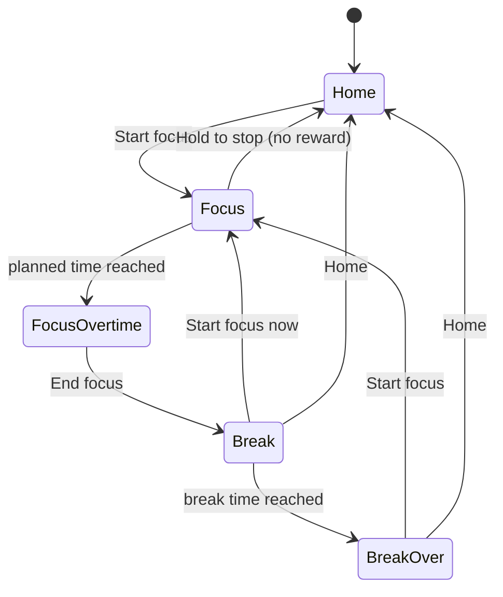

# ARCHITECTURE.md

> The coding agent's reference for structure, rules and settled decisions. `docs/DESIGN.md` covers look and feel.
> `(ADR-0xx)` tags point to the human-facing log `docs/DECISIONS.md`; the rule stated here is what counts.
> `[ASSUMPTION]` = default applied, not yet confirmed by the owner (see §12).

## 1. Product

- **Sift**: Pomodoro-style focus timer with collectible rewards (inspiration: Focus Pomo).
- **Loop**: focus → earn a random animal → it is placed on a floating voxel island → the island grows → focus again.
- **Platforms**: Phase 1 local desktop web app (done). Phase 2 iOS/Android by wrapping the same code with Capacitor (deferred, ADR-002).
- **Work model**: features come from `docs/guidance_vN.md`, implemented step by step. Everything so far is guidance_v1.

**Philosophy**: focus is the product, rewards are the garnish. Honest time: rewards only for real, completed focus. Gentle motivation: longer focus helps only slightly, and nothing worse than "no reward" ever happens. The island records accumulated effort.

**Immersion principles** (win every conflict):
1. Nothing interrupts focus: no popups, toasts, badges, or reward animations.
2. Focus shows only the timer over a dimmed island; controls stay hidden until needed.
3. Each cycle transition is one tap.
4. Rewards are revealed only on Break.
5. The timer is never wrong (tab switches, backgrounding, reloads).

## 2. Stack and conventions

| Area | Choice |
|---|---|
| Language / build | TypeScript (strict), Vite |
| UI | React 18, CSS Modules + CSS custom properties from `tokens.css` (ADR-001) |
| 3D | three.js + @react-three/fiber. No drei: custom `CameraRig` (ADR-009) |
| State | Zustand (store with injectable deps) |
| Storage | IndexedDB via Dexie, behind `StorageAdapter` |
| Sound | Synthesized with Web Audio, no audio files (ADR-006) |
| Tests | Vitest (logic), Playwright smoke test `npm run e2e` |
| Mobile (later) | Capacitor |

- All code, comments, docs, commits and UI text in English. UI strings only in `src/ui/strings.ts`.
- **Gameplay** tunables (reward odds, timer limits, placement, and later gold, scoring, war) live in `shared/balance/balance.ts` (frozen, with `BALANCE_VERSION`; bump it on every value change). Client-only tunables (render, UI, island shape) live in `src/domain/config.ts`. Visual values come from `DESIGN.md`; never inline new ones (ADR-030).

## 3. Screens and flow


```mermaid
stateDiagram-v2
    [*] --> Home
    Home --> Focus: Start focus
    Focus --> FocusOvertime: planned time reached
    FocusOvertime --> Break: End focus
    Focus --> Home: Hold to stop (no reward)
    Break --> Focus: Start focus now
    Break --> Home: Home
    Break --> BreakOver: break time reached
    BreakOver --> Focus: Start focus
    BreakOver --> Home: Home
```

| Screen | Rules |
|---|---|
| Home | Island with idle animals; limited rotate/zoom; current cycle + Start focus; top bar (theme, collection, settings) |
| Focus | Fullscreen + wake lock. Near-black overlay over the island as it was at focus start. Large timer only. Hidden "Hold to stop" (1.5 s long press) shows for 3 s on pointer move. At planned time: count-up `+05:23`, one chime, permanent End focus button |
| Break | Reward reveal (card fades in, model spins, tier chime; after 3.5 s or tap the animal joins the island; buttons usable throughout, ADR-011) or a neutral no-reward message. Break countdown, then "Ready for the next one?" with chime. Never auto-starts focus |
| Settings | Focus 5–60 min (step 5), break 1–30 min, chimes toggle, week starts on Monday/Sunday (only with `features.stats`); saves instantly |
| Inbox | Deferred notices (`domain/inbox`, store `inbox`, Dexie `inbox`): queued at any time, shown one at a time (oldest first) as a `NoticeCard` on Home and Break only; `dismissNotice` is a no-op while focusing, `selectCurrentNotice` returns nothing during Focus. Visual events tied to a notice play when it is shown, not when the data changed (ADR-035) |
| Tabs | Island (Home/Focus/Break + Settings/Collection pages), Stats, Friends, Group; non-Island tabs appear only with their feature flag, and with one tab there is no tab bar. `activeTab` lives in the store, in memory only (every launch opens on Island). Focus always runs on Island and hides the tab bar; `setTab` is ignored while focusing, and leaving Island ends a running reveal. Space and hold-Esc exist only on Island screens. Other tabs cover the canvas, which stays mounted with `frameloop="never"`; during a break they show a pill with the break timer (ADR-036) |
| Stats | `domain/stats/days.ts`: `aggregateByDay(sessions, { timeZone, from, to })` → one `DayStat` per day (zeros included); `monthSummary(days, { today })`. Only `completed` sessions count (`balance.stats.includeAbandoned`); minutes = real `endedAt − startedAt` (not the reward cap); a session belongs to the local day it **started** in the user's current time zone. Daily average = month total ÷ days elapsed (through today in the current month, all days in past months). Epoch → local date via `Intl.DateTimeFormat`; calendar math on `YYYY-MM-DD` strings in UTC (ADR-037) |
| Economy | `features.economy`. Gold = sum of the append-only `ledger` store (`domain/economy/ledger.ts`), cached as store `gold`, recomputed on load. `spendGold(amount, reason, refId, grant)` writes debit + granted item in one transaction or fails (`InsufficientGoldError`, no memory fallback). 30 starter gold once per save (`starter` entry) (ADR-039). **Expiry** (`shared/rules/expiry.ts` `computeExpirations`): an active animal departs at exactly `acquiredAt + 7 days` (Unicorn exempt) and leaves gold by rank `[1, 3, 8, 25]`; `endedAt` = that moment. Store `applyExpirations` writes statuses, one credit per animal (`refId` = animal) and one `animals_departed` notice in one commit; it runs at start, after an import, on every transition to Home or Break and every 60 s while not focusing, never during Focus; one run at a time. Test-mode and dummy animals are memory-only: their departures never reach storage (ADR-040). **Departure presentation** (`pendingDepartures(inbox, phase)` in `domain/inbox`): departed animals named in a queued `animals_departed` notice stay drawn (`buildIslandModel` input `leaving`) until the notice is shown; the shown notice's animals get `IslandAnimal.departure` (order) and `world/animals/Departures.tsx` plays puffs and coin arcs (max `config.render.maxAnimatedDepartures` = 10, the rest vanish with one pile burst). `heldGold` = gold of unshown departure notices, which the HUD holds back. Their tiles are already free for new animals. **Coin pile**: `IslandModel.goldPileLevel` = `goldPileLevel(gold − heldGold, balance.economy.pileThresholds)` (0–6, 0 with the economy off), drawn by `world/props/CoinPile.tsx` (one instanced mesh, layout `pileVoxels`) on `COIN_PILE_TILE`. **HUD** (`screens/home/Hud.tsx`, Home's top bar only): `selectShownGold` (gold − held departure gold, counted up by `useCountUp`) and `selectActiveUnicorns`; gold opens an info bubble until the Shop exists. **Poke and Collection**: `buildIslandModel({ showExpiry })` adds `IslandAnimal.expiresAt` (not for exempt species) and the poke bubble shows `strings.poke.timeLeft`; Collection counts stay all-time plus `On island: n` |
| Collection | All 50 species (silhouettes if not owned, counts if duplicated) + stats: total focus time, completed sessions, species `n / 50` |
| Cosmetics | `features.cosmetics`. **Inventory** (`domain/cosmetics/inventory.ts`): `cosmetics` store, one row per owned instance (`{ id, kind, defId, acquiredAt, source }`); skins and themes are owned once, buildings any number of times; the default skin and theme are always owned; owned items stay usable after a newer pack drops them (the registry keeps retired items). `buyProblem` (unknown, not for sale: not purchasable / retired / outside its window / above `minClientVersion`, already owned, skin of a species never earned), `grantFor`, `equipSkin` (per species) / `equipTheme`, `sanitizeEquipped` (an equipped item that is not owned or unknown falls back to the default on load), `unplacedBuildings` (owned − placed per definition). Store: `cosmetics`, `equipped` (kv `equipped`), `placedBuildings`; `buyItem(defId)` → `spendGold` (debit + item in one transaction, `BuyError` / `InsufficientGoldError`); `equipSkin`, `equipTheme` (`EquipError`). `Commit` carries `equipped`, `buildingsPut`, `buildingsRemove`. App passes `equipped` and buildings to `buildIslandModel` only with the flag on. **Shop** (`screens/shop/ShopScreen.tsx`, view `shop`, opened from the HUD gold counter on Home): `domain/cosmetics/shop.ts` `shopView({ now, clientVersion, discovered })` → featured items of the newest started release (`newestRelease`), skins of earned species in catalog order, themes, buildings by category (`special` never sold); `itemBadges` (New for `balance.shop.newBadgeDays` = 14 after the release date, `leavesInMs` for limited items). Cards use atlas sprites; the confirm sheet shows a turning `ItemPreview` (skinned animal, building, or a small island in the theme) and offers Equip after buying a skin or theme |
| Build mode | `features.cosmetics`, view `build` (Home only, render mode `home` so the camera still turns). UI state in `screens/build/buildState.ts` (`buildUi`: `placing { defId, rotation, movingId? }`, ghost `tile`, `selected`), shared by the DOM panel (`BuildScreen`: tray of `unplacedBuildings`, Rotate/Cancel/Place, Move/Rotate/Store; keys R, arrows, Enter, Esc) and the in-canvas layer (`app/BuildIslandLayer` → `world/build/BuildLayer`: invisible instanced tile targets, ghost + footprint tint, selection outline; passed as `Scene` children). Hover moves the ghost with a mouse, a tap (≤ 6 px drag) moves it or selects a placed building. Store `placeBuilding({ defId, tile, rotation, movingId? })` → `PlaceProblem \| 'none_left' \| 'not_idle' \| null`: checks `placementProblem`, writes the building and the animals it displaces (`repairPlacements` with the new building) in one commit; `storeBuilding(id)`. `suggestTile` picks the first fitting tile from the center (empty tiles first). Animals whose home tile changes walk there |
| Content Studio | `/studio`, development builds only (`main.tsx` branch on `import.meta.env.DEV`, dropped from production). Lists every item and family with filters (kind, release, family, missing sprite, validation errors), previews it on a sample island through the normal `Scene` (3 terrains, day/night, any block theme, drag to rotate, presets running), edits names/prices/tags/availability, edits a skin family's transform with a live 50-species sprite grid and per-species overrides, and tests building placement (footprint tint, `placementProblem`, R rotates). Unsaved edits are a draft pack merged into the live registry. Save posts to the dev-server plugin `/__studio/save` (`vite.config.ts`, `apply: 'serve'`), which writes only item files under `content/` (`isWritableContentPath`, `formatContentJson`). In development an invalid file does not stop the app: `assemblePack` leaves the broken entries out and the Studio lists the problems (`baselineProblems`); production builds still fail on any problem |

## 4. Timer engine

```ts
type Phase =
  | { kind: 'idle' }
  | { kind: 'focus'; startedAt: number; plannedMs: number; sessionId: string }
  | { kind: 'focusOvertime'; startedAt: number; plannedMs: number; sessionId: string }
  | { kind: 'break'; startedAt: number; plannedMs: number; rewardId?: string }
  | { kind: 'breakOver'; rewardId?: string };
```

- Persist only `idle`, `focus`, `break`. `resolvePhase(phase, now)` derives `focusOvertime` / `breakOver`, so they cannot be missed (ADR-003).
- Elapsed = `now() - startedAt`, never accumulated ticks. Display ticks (250 ms) are not a source of truth. Recompute on `visibilitychange`. Phase is persisted on every change and restored on reload.
- **Focus end**, in one DB transaction (no double rewards): effective time `min(endedAt - startedAt, 60 min)` → if ≥ 25 min roll tier, species, tile → save session + animal + next `break` phase.
- Time-dependent logic takes an injected `now()`.

## 5. Rewards

- **Effective focus** = planned + overtime, capped at 60 min. **Minimum 25 min**. Abandon = no reward.
- Focus can be set below 25 min; such sessions earn only with overtime, and the no-reward message explains it (ADR-012) `[ASSUMPTION]`.
- **Tiers**, lowest to highest: Common < Mythic < Epic < Legendary (`TIERS` in `config.ts`; ADR-026/027).
- Tier is rolled; odds interpolate linearly from 25 to 60 min (`[ASSUMPTION]`); species is then uniform within the tier. Pure functions with an injectable RNG: `shared/rules/reward.ts` (generic over the catalog), bound to `CATALOG` in `domain/reward/reward.ts`.

| Tier | 25 min | 60 min | Species |
|---|---|---|---|
| Common | 60% | 50% | 25: Chick, Rabbit, Duck, Hamster, Squirrel, Hedgehog, Mouse, Frog, Fish, Snail, Ladybug, Bee, Butterfly, Beetle, Turtle, Crab, Starfish, Mole, Sparrow, Pigeon, Hen, Guinea Pig, Lizard, Bat, Ferret |
| Mythic | 28% | 32% | 14: Sheep, Pig, Cat, Dog, Goat, Raccoon, Penguin, Owl, Otter, Beaver, Capybara, Axolotl, Parrot, Koala |
| Epic | 10% | 14% | 9: Horse, Cow, Deer, Fox, Wolf, Bear, Panda, Red Panda, Peacock |
| Legendary | 2% | 4% | 2: Unicorn (rainbow mane, rainbow bursts), Tiger (forehead 王). Both sparkle |

- Catalog is static data (`domain/animals/catalog.ts`): `id`, `name`, `tierRank`, `tier` (label), `modelId`, `idleAnimation`, `footprint`. Duplicates allowed; each is placed.
- **Tier rank, never names**: `TierRank` 0 Common … 3 Legendary. Odds (`config.reward.tierAt*` arrays), species pools, chimes (`reveal:<rank>`), styles (`data-tier="<rank>"`), and later gold, scoring and war all key off the rank. Names live only in `TIERS` (stored label) and `strings.tiers` (display); a rename touches those two lists. The only name comparisons left are the frozen Dexie v2/v3 upgrades.

## 6. 3D world

**Island model** (ADR-034)
- The world draws plain data, never the store: `domain/island/model.ts` `buildIslandModel(...)` → `IslandModel { ownerId, seed, islandLevel, blockThemeId, animals[{ id, speciesId, tierRank, tile, skinId }], buildings[], goldPileLevel, championWeek? }`; `IslandMode` = `own | visit | battle | move` (separate from the render mode).
- `world/Scene.tsx` owns the canvas, lights, camera, clouds and render driver and takes `islands: { model, mode }[]`; `world/IslandScene.tsx` draws one model (bob, terrain, stream, camp, animals) with no global state. Several islands sit side by side along the screen's horizontal axis and the camera fits them all; one island renders exactly as before.
- Dev-only: `?twoIslands[=seed]` renders a second island (`app/devTwoIslands.ts`, stripped from production builds).

**Scene and camera**
- One persistent `<Canvas>` for Home, Focus and Break; never remounted. Break reward card uses its own small canvas only while visible; Collection, Day detail and Shop use generated pixel-art sprites from the content atlas (`ItemSprite`, `content.sprite(id)`; flat front-view `VoxelSprite` only as a fallback and for the Studio's live grid) (ADR-007, ADR-042).
- **Content pipeline checks** (ADR-042): `npm run content:validate` (`shared/content/validate.ts` after `assemblePack`) checks palette keys, budgets, footprint vs model bounds, `balance.prices`, availability dates and that every item has a fresh sprite (atlas stores an input hash per item). It runs in CI (`.github/workflows/ci.yml`) and inside `npm test`. `npm run content:sprites` (`tools/sprite-gen/main.mjs` → dev page `/studio/sprites` → `screens/studio/spriteRenderer.ts`) regenerates `content/sprites/atlas.{png,json}`.
- Orthographic isometric camera (azimuth 45°, elevation ≈ 35.26°). Fits the island top + 35% of the underside with a 5% margin, re-fits on growth, avoids the screen area under panels (ADR-014).
- Render modes: Home full (60 fps, interaction). Focus dimmed: fixed camera, 24 fps cap, animals at 0.25 speed, no clouds, 1 s camera pull-back. Break full, fixed camera.

**Island**
- Deterministic: same seed + same **island level** = same island. `islandLevel` = lifetime earned animals on this save, whatever their status (`domain/island/level.ts`), so departures never shrink the island (ADR-032). Shapes are **monotone** (growth only adds tiles), so stored animal coordinates (relative to center) stay valid. An island move keeps the level and changes only the seed.
- Size: side = `max(7, ceil(sqrt(level × 3)))`, odd. Near-circular outline (Euclidean + seeded jitter) (ADR-017).
- Terrain levels 1–3, each 0.5 block. Domain-warped noise + weak back-high tilt, terraced (mostly plains, some hills/lowlands), flat around the camp (ADR-018).
- Underside: inverted pyramid with random gaps. Blocks are flat-colored cubes, one `InstancedMesh` per type, ±4% tint (ADR-008).
- During Break with a reward, the island is sized from `level - 1`; the growth (700 ms scale-in) shows when returning Home (ADR-013).

**Camp and night mode** (ADR-016, ADR-017)
- `Settings.theme` `light | dark`, toggled from the top bar, locked during Focus.
- Campfire on (0,0), log cabin on (-2,0) with its door facing the fire, coin pile tile (-2,1) beside the cabin (the pile prop, F3). All three are `CAMP_RESERVED` (never used by animals or buildings) and flat; the pile tile lies inside the stream's camp clearance, so it is always dry.

**Occupancy** (ADR-033)
- `domain/island/occupancy.ts` `getOccupancy({ seed, islandLevel, animals, buildings })` → `Map<"x,z", TileInfo>` with `height, water, campReserved, buildingId?, animalIds, walkable, buildable`. Animal placement and save repair use it; building placement, routines, war formation and island moves must too.
- Save repair runs on every load (`repairPlacements`): an active animal on water, camp, a building or off the island moves to the nearest free tile and is saved. Idempotent.
- Focus routines picked by theme at focus start: day = animals walk into the cabin; night = they sleep near it. They return on Break. Reload into Focus shows the end state; reduced motion snaps.

**Stream** (ADR-020, ADR-021)
- One winding stream per island, from the seed only: best-scoring wobbling chord, avoids the camp, starts at a spring, falls off the rim outward. Cached per seed (~500 path traces).
- Stream tiles keep their natural level with a 0.25 bed cut; water never flows uphill; only the first unbroken run is water. Water tiles are excluded from placement.
- Modules: `domain/island/stream.ts` (path), `world/stream/streamMesh.ts` (ribbon, falls, bank mesh), `world/stream/Stream.tsx` (render, flow, stateless splash particles).

**Animals**
- One 1×1 tile per animal; placed on a random free grass tile near the center; idle stays in the tile: turn, hop, shuffle (ADR-005).
- Exception: the butterfly flaps (separate wing meshes) and flies up to 1.2 tiles from its tile (ADR-024).
- World scale 0.25× (animal voxel = 1/6 block in the model, 1/24 on the island) (ADR-014).
- Model limits: width ≤ 6 voxels; depth ≤ 6, or 8 for Epic and Legendary (ADR-025).
- Poke: clicking an animal (not on Focus) shows a `!` bubble (with the economy on: its time left, e.g. `3d left`; Unicorn keeps `!`) and forces one idle action. Render-only state (ADR-022).
- **Skins, themes and buildings** (renderer, Steps 3.4/3.8): `world/voxel/geometry.ts` builds animal geometry per `(species, skin)` (species palette ← skin palette, overlay voxels via `withOverlay`), block meshes per theme palette (the island's instanced meshes swap geometry, the layout is not rebuilt), and building meshes per definition (`BUILDING_VOXEL` = 1/8 block, so a footprint tile is 8 voxels; parts are separate meshes around their pivot, animated by part presets; `light` glows at the model's `flame`/`glass` voxels). `IslandScene` reads `model.blockThemeId` for terrain, stream, camp and cloud colors and the theme's `ambient` particles (Home and Break only). Unknown skin or theme ids fall back to the default look. `clearContentGeometry()` drops cached meshes after content changes.
- **Building placement** (`domain/build/placement.ts` `placementProblem`, on the occupancy grid): every footprint tile on the island and at one height, no camp tile, no other building (the one being moved excepted), no water unless `allowOnWater`, and at least `balance.build.minFreeTiles` (6) land tiles left for animals; tiles with animals are allowed. `footprintTiles(tile, footprint, rotation)`: `tile` is the low-x/low-z corner, 90°/270° swap width and depth. Occupancy marks every footprint tile; a footbridge (`allowOnWater`) stays walkable (`bridge`) but animals never live on water (`isStandable`).
- **Behavior presets** (Step 3.2): reusable code in `world/presets/` (idle sets, part animations `spin/sway/bob/flap`, particle fields, light glows) referenced by id from content. `content/presets.json` lists the ids per kind; `buildPack` rejects unknown ids and a test keeps the list equal to the code (`PRESET_IDS`). A new preset is an app release; items using it set `minClientVersion`.
- Voxel models are TS data in `src/assets/voxels/<id>.ts`, merged into one cached `BufferGeometry` per species (hidden faces culled). Voxels reference **named palette keys** (`shared/content/palette.ts`) with a default palette per model; terrain and camp colors are the keyed `defaultBlocks` record (`world/palette.ts`). Raw colors never appear in model shapes.

## 7. Platform layer

Capability APIs only through `src/platform/<name>/` (interface `index.ts`, web `web.ts`, later `native.ts`):

| Adapter | Web | Native (later) |
|---|---|---|
| `StorageAdapter` | IndexedDB (Dexie) | Capacitor SQLite / Preferences |
| `WakeLockAdapter` | Screen Wake Lock API | keep-awake plugin |
| `FullscreenAdapter` | Fullscreen API | immersive mode |
| `NotifyAdapter` | Web Audio chimes | scheduled local notification for focus end (JS may be suspended) |
| `HapticsAdapter` | no-op | Capacitor Haptics |
| `FilesAdapter` | download link / file picker | share sheet / document picker |

- "Capability API" = storage, wake lock, fullscreen, audio/notifications, haptics. DOM events, `visibilitychange`, `matchMedia`, `Date.now` are fine in `ui/`, `screens/`, `world/` (ADR-010).
- Write no untested native stubs before M7 (ADR-002).

## 8. Data model

```ts
type Tier = 'common' | 'mythic' | 'epic' | 'legendary';
type TierRank = 0 | 1 | 2 | 3;
interface Settings { focusMinutes; breakMinutes; soundEnabled; theme: 'light' | 'dark'; weekStartsOn: 0 | 1; showFocusPresence; liveProgress }
interface FocusSession {
  id: string; startedAt: number; plannedFocusMs: number; endedAt?: number;
  effectiveFocusMs?: number; status: 'running' | 'completed' | 'abandoned'; rewardAnimalId?: string;
  togetherRoomId: string | null;
}
interface PlacedAnimal {
  id; speciesId; tier: Tier; tierRank: TierRank; tileX; tileZ; acquiredAt; sessionId;
  status: 'active' | 'departed' | 'vanished' | 'spent'; endedAt: number | null;
  endReason: 'expired' | 'war' | 'island_move' | null; verified: boolean; pinned: boolean;
}
interface WorldState { seed: number; blockThemeId: string }   // generated once
interface ActivePhase { phase: Phase }  // restores an in-progress session
```

- Dexie tables: `kv` (settings, world, phase, equipped), `sessions`, `animals`, `ledger`, `cosmetics`, `placedBuildings`, `islandHistory`, `inbox`, `contentPacks` (types in `domain/types.ts`). Schema **v4** (v2, v3 rename stored tiers; v4 = guidance_v2 §4.1).
- Animals are never deleted: they change `status`. Only `active` animals are on the island; the Collection counts all.
- Every change adds a new `db.version(n)` with an `upgrade`; never edit old versions. From v4 on, row upgrades are pure functions in `db/migrations.ts`, shared by every storage adapter and the backup import.
- Field names follow the existing tree (`tileX/tileZ`, epoch-ms `acquiredAt`), not the guidance sketch (`tile`, ISO `earnedAt`).
- UUID ids and UTC epoch-ms times, ready for future sync. The island itself is never stored (derived from seed + count).
- **Backup** (Settings → Data): `{ format: 'sift-backup', version: 1, exportedAt, schemaVersion, data: { <store>: rows[] } }` with every store. `StorageAdapter.exportAll` / `importAll` are generic over stores; import validates (`domain/backup.ts`), then replaces all stores in one transaction. Backups from an older `schemaVersion` are upgraded with the same row migrations as the database.

## 9. Runtime config

`config/app.yaml`, bundled at build time (ADR-015, ADR-019):
- All developer switches live under `testMode`:
  - `resetMapOnStart`: new seed and all placed animals deleted on every start.
  - `animals` (`enabled`, `speciesCount`, `allSpecies`): fills the island in memory at startup; never stored, rewards untouched.
  - `dummyData`: `app/devDummy.ts` adds deterministic sample data in memory at startup (store dep `dummy`): ~6 weeks of sessions and a few Inbox notices. Never committed to storage, never exported, not re-added after an import. **Every phase adds sample data for its feature there** (gold, cosmetics, friends, groups, war, …) so it can be seen without real play (ADR-038).
- They are honored only in development builds (`import.meta.env.DEV`); production builds force them off (`resolveRuntimeConfig`). Committed value is `false`; enable locally, never commit.
- `features.<name>`: one flag per guidance_v2 phase (`FEATURES` in `runtimeConfig.ts`), read in every build. Committed values are all `false` (a unit test enforces it); the owner turns a phase on once it is finished. The build variable `VITE_FEATURES=stats,…` (or `all`) turns flags on for test builds: `npm run e2e` builds `dist-e2e` with the finished phases' flags (ADR-036).

## 10. Directory structure

```
docs/            ARCHITECTURE, DESIGN, DECISIONS (human log), CHANGELOG, PROJECT_STATUS, guidance_vN
config/app.yaml  runtime config
e2e/             Playwright smoke test
content/         data only (ADR-041): pack.json (contentVersion), presets.json, species/, skins/, skinFamilies/, blockThemes/, buildings/, releases/, models/ (DSL .ts, .vox + converted .json, palette-template.vox); guide: docs/CONTENT.md
tools/           node tools run through Vite's module runner (`node tools/run.mjs <file.ts>`): content-build/ (pack, builder DSL), vox-import/ (MagicaVoxel → model JSON)
shared/          pure rules that must run identically on client and server (ADR-031)
├── balance/     balance.ts: gameplay tunables + BALANCE_VERSION
├── content/     palette keys, model JSON type, zod schemas, buildPack (validation + family expansion)
├── rng/         the one seeded PRNG (mulberry32) + hash01, clamp, lerp
└── rules/       tier.ts, reward.ts, placement.ts, expiry.ts (later scoring, war, …)
src/
├── app/         App, routing, runtimeConfig.ts
├── screens/     home, focus, break, settings, collection, stats; TabPage, NoticeCard
├── domain/      pure logic: config, types, random, timer/, reward/, animals/, island/ (+stream), stats/, content/ (registry + baseline pack)
├── world/       Scene, IslandScene, Clouds, RenderDriver, palette, voxel/, island/, animals/, camera/, props/ (camp), stream/, preview/
├── assets/voxels/  animal models + builder
├── store/       Zustand store
├── platform/    adapters (§7)
├── db/          Dexie schema, repositories
└── ui/          tokens.css/ts, strings.ts, hooks, components/
```

- `shared/` imports only `shared/` (relative paths), uses no browser/Node/Deno globals, never calls `Math.random()` or `Date.now()` (inject `Rng` and `now`); `shared/shared.test.ts` enforces this.
- `shared/` may import one package, `zod` (content schemas, ADR-041).
- `domain/` imports only itself and `shared/` (`domain/random.ts` re-exports `shared/rng`); the one exception is `domain/content/baseline.ts`, which bundles the data under `content/` (including `content/models/` builder files, which use `tools/content-build/dsl.ts`) and the built-in models in `src/assets/voxels`. Both authoring paths (MagicaVoxel import, builder DSL) emit the same canonical model JSON (`canonicalModel`). Game code reads species, skins, themes and buildings only through `domain/content` (`content` registry), never by importing an item file. `world/` and `screens/` may use `domain/`, `shared/` and `store/`; `world/` may also import `ui/strings` for text drawn in the scene (poke label). Capability APIs only in `platform/`.

## 11. Milestones

| | Scope | Status |
|---|---|---|
| M1 | Timer core: cycle, reload-safe, settings | Done |
| M2 | Rewards: 25 min min, 60 min cap, tier roll, atomic commit | Done |
| M3 | Voxel island, growth, camera | Done |
| M4 | Focus immersion: overlay, timer, fullscreen, wake lock, hidden controls, sound | Done |
| M5 | Animals (now 50), idle animations, reward reveal | Done |
| M6 | Collection, stats, responsive layout | Done |
| M7 | Mobile: Capacitor, native adapters, local notifications | Not started |
| M8 | Stats & tabs (guidance_v2 Phase 1): tab shell, per-day stats, overview, week, month calendar, day detail | Done, behind `features.stats` |
| M9 | Economy (guidance_v2 Phase 2): ledger and wallet, expiry, departure presentation, coin pile, HUD counters, collection/poke updates | Done, behind `features.economy` |

**Rules for the agent**
- Every `domain/` module has Vitest tests (time math, 25 min threshold, 60 min cap, probabilities sum to 1, island size and monotonicity).
- Check every Focus-screen addition against §1.
- Performance: Home 60 fps with 100 animals (not yet measured); Focus low GPU. No per-frame allocations; dispose on unmount.

## 12. Open questions (current defaults, ADR-004)

| # | Question | Default |
|---|---|---|
| Q1 | Fish tier | Common |
| Q2 | Tier odds 60/28/10/2 → 50/32/14/4 | Accepted |
| Q3 | Animals on Focus | Slowed + day/night routines |
| Q4 | Auto-start focus after break | No |
| Q5 | Ambient sound while focusing | No, end chime only |
| Q6 | Long breaks | Not supported |
| Q7 | Arrange animals | No; poke only |
| Q8 | Non-animal rewards | No |
| Q9 | Stats | Collection: all-time totals; Stats tab: daily, weekly, monthly (ADR-037) |
| Q10 | Accounts / sync | Local only, schema ready |
| Q11 | Mobile approach | Capacitor |

**Known limits**: no pathfinding (routine walks may cross the cabin or stream); the butterfly may fly over water and the camp.
